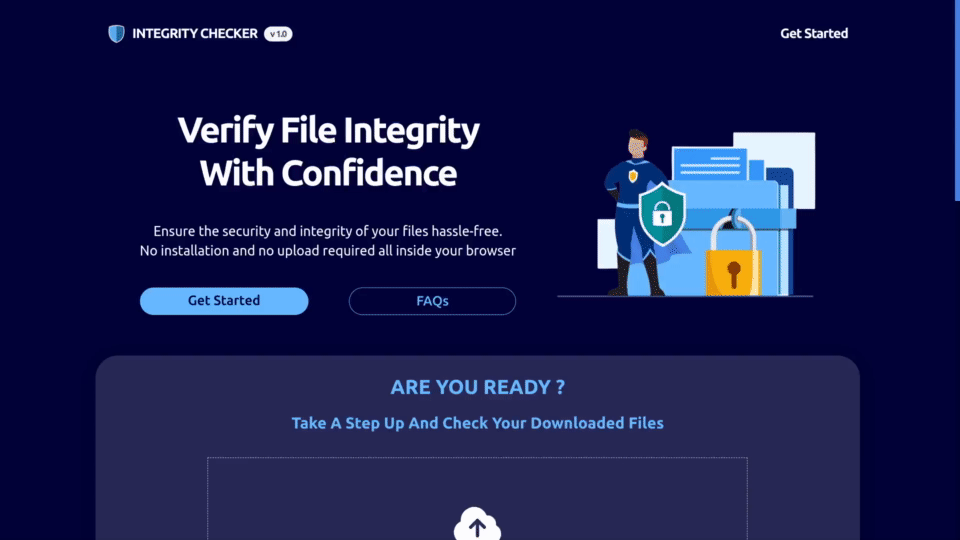
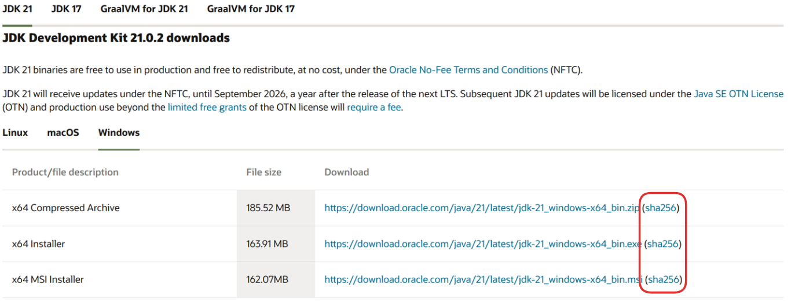
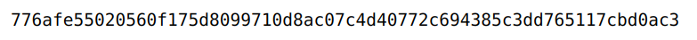
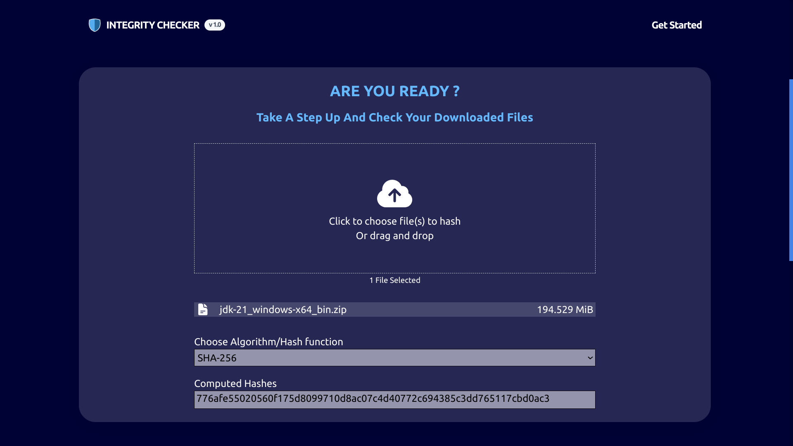

<a name="readme-top"></a>

<!-- PROJECT SHIELDS -->


<div align="center">
  <!-- Contributors -->
  <a href="https://github.com/el-amine-404/integrity-checker/graphs/contributors"></a>
  <!-- Forks -->
  <a href="https://github.com/el-amine-404/integrity-checker/network/members"></a>
  <!-- Stars -->
  <a href="https://github.com/el-amine-404/integrity-checker/stargazers"></a>
  <!-- issues -->
  <a href="https://github.com/el-amine-404/integrity-checker/issues"></a>
  <!-- license -->
  <a href="https://github.com/el-amine-404/integrity-checker/blob/master/LICENSE.txt"></a>
  <!-- linkedin -->
  <a href="linkedin.com/in/amine-el-houjjaji"></a>
</div>

<!-- PROJECT LOGO -->
<br />
<div align="center">
  <a href="https://github.com/el-amine-404/integrity-checker">
    
  </a>
  <h3 align="center">INTEGRITY CHECKER</h3>
    <p align="center">
    A hassle free way to check the integrity of your downloaded files
    <br />
    <!-- <a href="https://github.com/el-amine-404/integrity-checker"><strong>Explore the docs »</strong></a>
    <br /> -->
    <br />
    <a href="https://integrity-checker.pages.dev">View Live Demo</a>
    ·
    <a href="https://github.com/el-amine-404/integrity-checker/issues">Report Bug</a>
    ·
    <a href="https://github.com/el-amine-404/integrity-checker/issues">Request Feature</a>
  </p>
</div>

<!-- TABLE OF CONTENTS -->

<!-- ## 📜️ - Table of Contents (ToC) <a id="ToC"></a> -->

<details><summary>Table of Contents (ToC)</summary>

- [About The Project](#about-the-project)
  - [Built With](#built-with)
- [Usage](#usage)
- [Contributing](#contributing)
- [License](#license)

</details>


<!-- ABOUT THE PROJECT -->
## About The Project

<div align="center">
  
  <p><i>Integrity Checker</i></p>
</div>


An online SHA checksum generator wich eliminates the need to use third party tools or remember specific shell commands and offers the following features:
- No dependency on a third JS library like [crypto-js](https://github.com/brix/crypto-js "https://github.com/brix/crypto-js"), Instead it uses [***`Web Crypto API`***](https://developer.mozilla.org/en-US/docs/Web/API/Web_Crypto_API "https://developer.mozilla.org/en-US/docs/Web/API/Web_Crypto_API") which makes it blazenly fast and secure
- Intuitive and easy to navigate UI
- 100% client based, no files are send to a server all the magic happens inside the browser
- 100% open source, don't take my words for granted you can review the code your self


<p align="right">(<a href="#readme-top">back to top</a>)</p>

### Built With

This wbesite is created using the following tech stack:

| TECH STACK            | USAGE                                                                                                                                           |
| --------------------- | ----------------------------------------------------------------------------------------------------------------------------------------------- |
| `HTML5`, `CSS3`, `JS` | front end                                                                                                                                       |
| `Figma`               | design                                                                                                                                          |
| `Git`, `GitHub`       | version control                                                                                                                                 |
| `VScode`              | text editor, alongside other cool vscode extensions to boost my productivity such as: `Prettier`, `Live server`, `intelliSense` and many others |

<br>
<br>
<p align="center">
  <a href="https://skillicons.dev">
    
    <br>
    
    <br>
    

  </a>
</p>

<p align="right">(<a href="#readme-top">back to top</a>)</p>

<!-- USAGE EXAMPLES -->
## Usage


- **STEP #1** - Find the checksum of the downloaded file, usually it is located near the download button/link, For example:

<div align="center">
    
  <p><i>Checksum file location for java jdk</i></p>
</div>

- **STEP #2** - Visit our website, select the file and choose the appropriate hash function and compare the generated hash with the one provided by the publisher


<div align="center">
    
  <p><i>sha provided by the publisher</i></p>
</div>

<div align="center">
    
  <p><i>sha generated by integrity checker</i></p>
</div>


<p align="right">(<a href="#readme-top">back to top</a>)</p>


<!-- CONTRIBUTING -->
## Contributing

Integrity Checker is an open-source project and we welcome contributions from the community.

If you have a suggestion that would make this better, please fork the repo and create a pull request. You can also simply open an issue with the tag "enhancement". Don't forget to give the project a star! Thanks again!

- STEP - 1 - Fork the Project
- STEP - 2 - Create your Feature Branch
    ```sh
    git checkout -b feature/AmazingFeature
    ```
- STEP - 3 - Commit your Changes
    ```sh
    git commit -m 'Add some AmazingFeature'
    ```
- STEP - 4 - Push to the Branch
    ```sh
    git push origin feature/AmazingFeature
    ```
- STEP - 5 - Open a Pull Request

<p align="right">(<a href="#readme-top">back to top</a>)</p>


<!-- LICENSE -->
## License

Distributed under the AGPL-3.0 license. See [`LICENSE`](LICENSE) for more information.

<p align="right">(<a href="#readme-top">back to top</a>)</p>